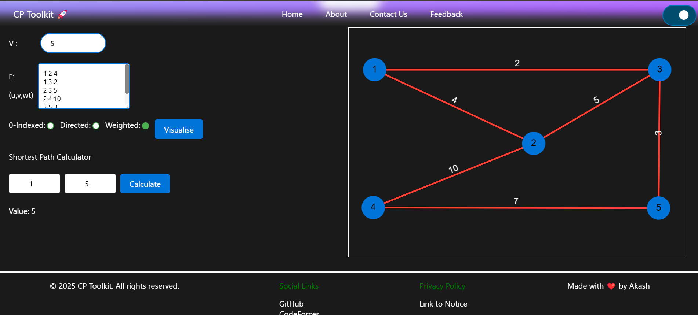
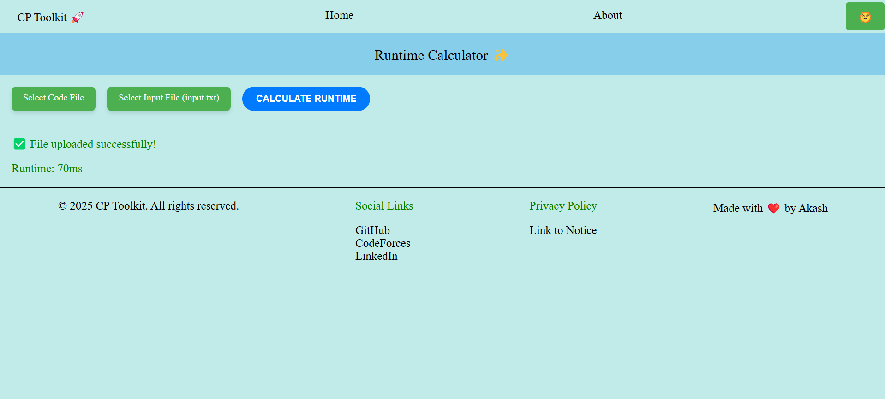

# Competitive Programming Toolkit

A powerful toolkit built for competitive programmers to enhance their workflow and improve problem-solving efficiency during time-constrained programming contests. This website is a comprehensive resource, providing a streamlined and intuitive environment for competitive programming.

## Features:

- **Factorization Tools:** Solve problems related to prime factorization efficiently.
- **GCD/LCM Calculator:** Quickly compute the greatest common divisor and least common multiple for a list of numbers.
- **Graph Visualizer:** Create and visualise graphs with shortest path calculations at your fingertips.
- **MST Generator:** Generate minimum spanning trees for your graph-related queries and understanding of topic for a problem.
- **Runtime Calculator:** Estimate the time complexity of your code so you get an idea of how your code would perform on system tests.
- **Rank Predictor:** Analyze your performance and predict your rank in Codeforces contests (upcoming).
- **Code Snippets Repository:** Access reusable snippets for frequently used algorithms and data structures
  
    1.  DSU
    2.  Binary Exponentiation
    3.  OR Subarray Queries
    4.  Segment Tree Subarray Maximum
    5.  Policy-based Data Structure (PBDS) Set and Multiset (For C++ users)

---

## Screenshots

### Home Page with Features


### Graph Visualiser


### Runtime Calculator (For C++)


---
  
## Tech Stack

- **Frontend**: React.js, React Router (for routing), HTML, CSS, JavaScript, CytoScape (For Graph Visualisation)
- **Backend**: Node.js, Express

---
  
## Getting Started

### Prerequisites

To run this project locally, you need to have the following installed:

- Node.js (v16 or above)
- npm (v7 or above)

### Installation

1. Clone the repository to your local machine:

   ```bash
   git clone https://github.com/cp-toolkit/cp-toolkit.git
   ```

2. Navigate to the project directory:

   ```bash
   cd cp-toolkit
   ```

3. Install the dependencies:

   ```bash
   npm install
   ```

4. Run the development server:

   ```bash
   npm start
   ```

5. The app should now be running on `http://localhost:5173/`.

### Environment Variables

Make sure to set up the following environment variables:

- `PORT`: Port number for the backend server (default: 8800)

---

## Contributing

We welcome contributions from anyone! If you want to contribute, please follow these steps:

1. Fork the repository.
2. Create a new branch (`git checkout -b feature-name`).
3. Make your changes and commit them (`git commit -am 'Add new feature'`).
4. Push to the branch (`git push origin feature-name`).
5. Open a pull request.

---

## License

This project is licensed under the MIT License - see the [LICENSE](https://github.com/akash-singh112/cp-toolkit/blob/main/LICENSE) file for details.